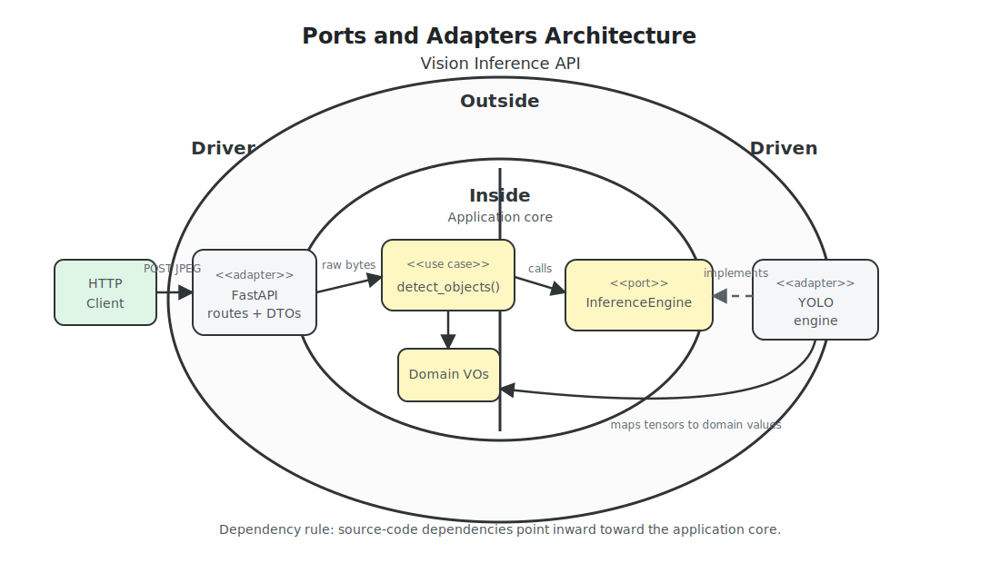
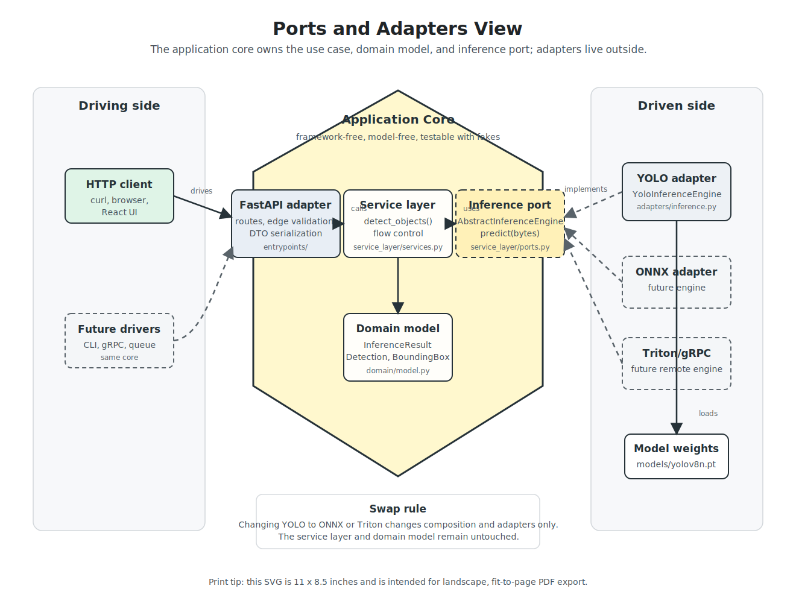
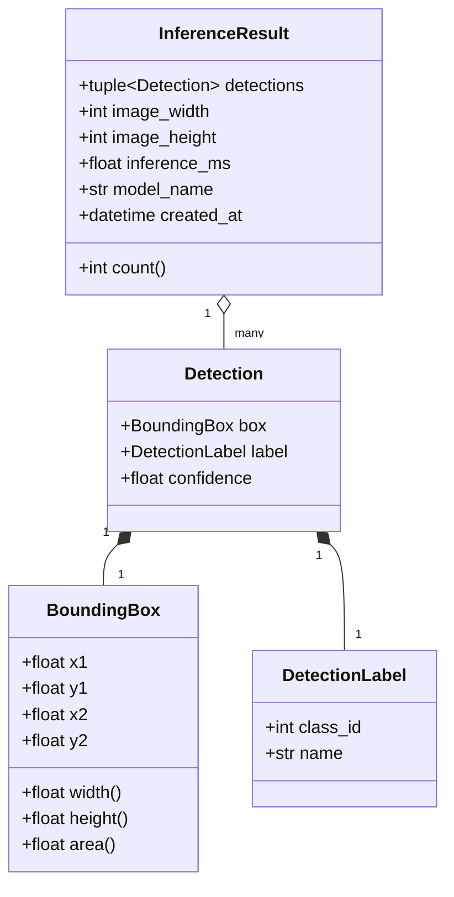
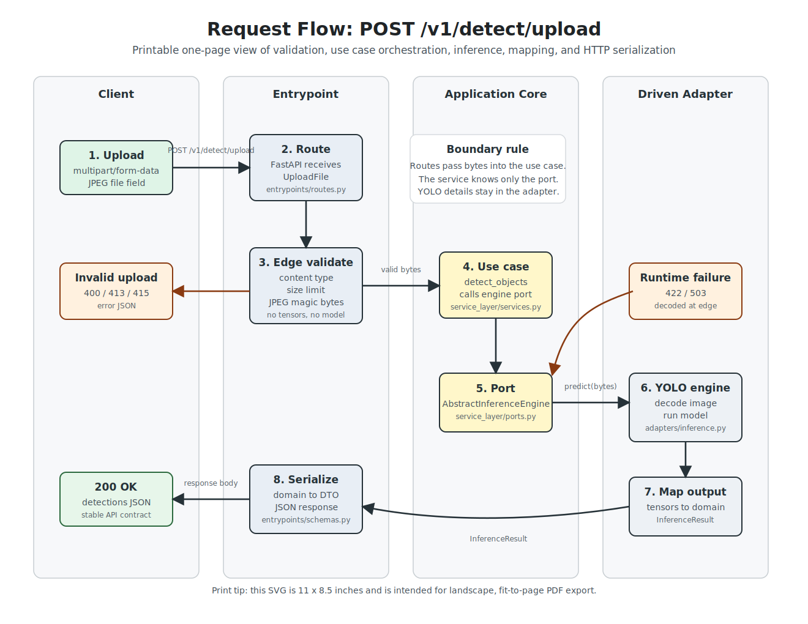
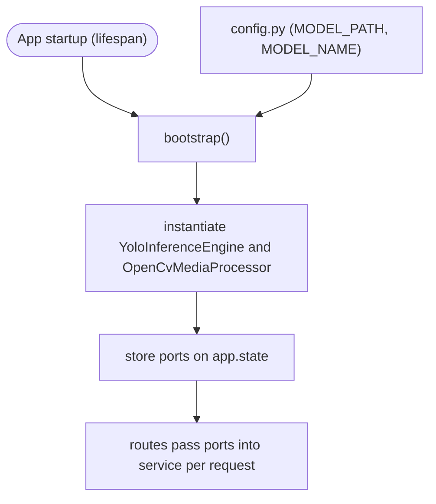
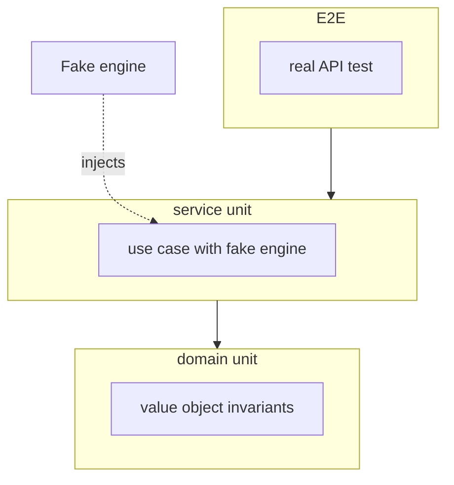
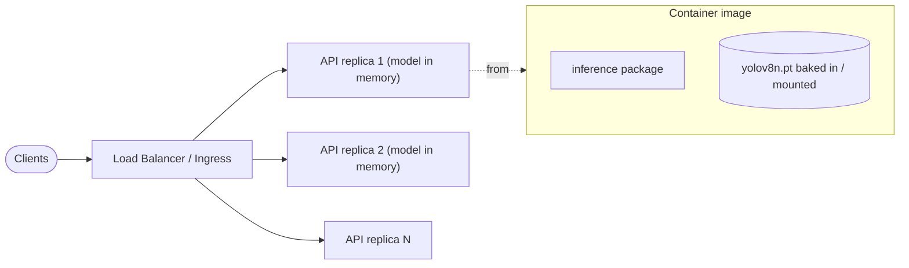

# Architecture & Ports Design — Vision Inference API

> **Status:** Implemented architecture reference.
> **Scope:** High-level architecture for a Python image/video upload inference API built on the **Ports & Adapters / Onion Architecture** described in *Architecture Patterns with Python* (Percival & Gregory — "Cosmic Python"; companion repo [`github.com/cosmicpython/code`](https://github.com/cosmicpython/code)).
> **Stack decisions:** FastAPI backend entrypoint · Next.js frontend adapter · Ultralytics YOLO (`yolov8n.pt`) · `uv` + `pyproject.toml` · `pytest` · `import-linter` + `mypy` as architectural guardrails.

This document fixes the layering, the machine-learning and media-processing **ports**, the request flow, the domain model, the testing strategy, and the scalability story.

## Contents

1. [Overview & philosophy](#1-overview--philosophy)
2. [Architecture at a glance](#2-architecture-at-a-glance)
3. [Ports & Adapters (hexagonal) view](#3-ports--adapters-hexagonal-view)
4. [Project structure](#4-project-structure)
5. [Key decision: where the ML port lives](#5-key-decision-where-the-ml-port-lives)
6. [Domain model](#6-domain-model)
7. [Request flow](#7-request-flow)
8. [Dependency injection & bootstrap](#8-dependency-injection--bootstrap)
9. [Testing strategy](#9-testing-strategy)
10. [Scalability & modularity](#10-scalability--modularity)
11. [Architectural guardrails (anti "vibe coding")](#11-architectural-guardrails-anti-vibe-coding)
12. [Tooling & setup](#12-tooling--setup)
13. [Assignment-requirement coverage](#13-assignment-requirement-coverage)
14. [Future extensions](#14-future-extensions)

---

## 1. Overview & philosophy

The service exposes a single HTTP endpoint that ingests an uploaded image or video, runs object detection with a pre-trained YOLO model, and returns structured detection metadata as JSON. The *interesting* part of the assignment is not the model — it is the **separation of concerns**: the business core must not know that it is being driven by HTTP, nor that media processing happens to use OpenCV or inference happens to use PyTorch/Ultralytics.

We organize the code as concentric layers and obey **one rule above all others — the Dependency Rule:**

> Source-code dependencies point **inward**. Outer layers (web, ML frameworks) depend on inner layers (service, domain). The **domain depends on nothing**. Nothing inner ever imports anything outer.

| Layer | Responsibility | May import | Must **not** import |
| --- | --- | --- | --- |
| **Domain** (`domain/`) | Pure business concepts: immutable value objects, invariants, domain errors. | stdlib only | service, adapters, entrypoints, FastAPI, torch, ultralytics |
| **Service layer** (`service_layer/`) | Use-case orchestration / flow control. Depends only on **abstractions** (ports). | `domain`, the abstract port symbol | concrete `YoloInferenceEngine`, FastAPI, torch, ultralytics |
| **Adapters** (`adapters/`) | Concrete gateways to external/heavy systems (the ML runtime). Maps raw output → domain. | `domain`, the port, ultralytics/torch | entrypoints |
| **Entrypoints** (`entrypoints/`) | Driving adapter: HTTP framework, edge validation, DTO ↔ domain mapping, exception→HTTP. | everything below | — |

The payoff: the ML engine is swappable, the domain is trivially testable, and the HTTP contract can evolve without touching business logic.

## 2. Architecture at a glance

The same inner/outer shape as a ports-and-adapters sketch: the application core owns the use case, domain model, and ports. HTTP, OpenCV, and YOLO are outside adapters.



Note that the concrete `YoloInferenceEngine` and `OpenCvMediaProcessor` depend on core-owned abstract ports. The dependency arrow points *inward toward the application core*; the core never imports concrete adapters.

## 3. Ports & Adapters (hexagonal) view

The same design seen as a hexagon: the **application core** sits in the middle, **driving adapters** (things that call us — HTTP clients, a React UI) on one side, **driven adapters** (things we call — inference engines) on the other. The port is the contract at the boundary, which is what makes the engine swappable.



The ports-and-adapters view is provided as a landscape SVG so it can be printed or exported as a single-page PDF without relying on Mermaid rendering.

- **Driving adapter (left):** FastAPI today; could be a CLI, a gRPC server, or a message consumer tomorrow — the core does not change.
- **Driven adapter (right):** `YoloInferenceEngine` and `OpenCvMediaProcessor` today; an ONNX engine, Triton client, remote gRPC engine, or alternate media processor later — selected at composition time, never referenced by the core.

## 4. Project structure

A backend `src`-layout package (`inference`) plus a separate Next.js frontend
adapter. The backend mirrors the book's verified conventions: `config.py` and
`bootstrap.py` at the package root, tests split into `unit` and `integration`.

```text
.
├── backend/
│   ├── pyproject.toml          # uv project; deps: fastapi, uvicorn, ultralytics, pydantic, pytest, import-linter, mypy
│   ├── .importlinter           # ARCHITECTURAL GUARDRAIL (forbidden-import contracts)
│   ├── src/
│   │   └── inference/
│   │       ├── __init__.py
│   │       ├── config.py       # env-driven settings
│   │       ├── bootstrap.py    # DI: instantiate concrete adapters once, inject ports
│   │       ├── domain/
│   │       ├── service_layer/
│   │       ├── adapters/
│   │       └── entrypoints/
│   │           ├── app.py      # FastAPI app, CORS, health, exception handlers
│   │           ├── routes.py   # POST /v1/detect/upload controller + edge validation
│   │           └── schemas.py  # Pydantic DTOs
│   └── tests/
│       ├── conftest.py
│       ├── unit/
│       └── integration/
├── frontend/
│   ├── app/
│   └── public/assets/demo/
├── docker-compose.yml
├── Makefile                    # backend / frontend / check targets
├── models/
│   └── yolov8n.pt              # weights (gitignored; documented download)
├── docs/
│   └── architecture.md         # this document
└── README.md
```

### Requirement → file mapping

| Assignment requirement | Module(s) |
| --- | --- |
| 1. Web adapter: `POST /v1/detect/upload` multipart media + edge validation | `entrypoints/app.py`, `entrypoints/routes.py`, `entrypoints/schemas.py` |
| 2. Abstract ports `AbstractInferenceEngine` and `AbstractMediaProcessor` | `service_layer/ports.py` |
| 3. Concrete `YoloInferenceEngine` (Ultralytics) | `adapters/inference.py` |
| 4a. Immutable domain value objects | `domain/model.py` |
| 4b. ML tensors → domain mapping | `YoloInferenceEngine` in `adapters/inference.py` |
| 4c. Clean JSON of domain data | `entrypoints/schemas.py` + `entrypoints/routes.py` |
| 5a. Fast unit tests with fake ports | `backend/tests/unit/test_services.py`, `backend/tests/conftest.py` |
| 5b. Integration tests with fake ports | `backend/tests/integration/test_api.py` |
| AI guardrails (README §3) | this document + enforced by `backend/.importlinter` |

## 5. Key decision: where the ML port lives

**Decision: put `AbstractInferenceEngine` in `service_layer/ports.py`, inside the application core.**

This makes the tutorial-style boundary explicit: the core defines what it needs from an inference engine, and infrastructure supplies an implementation. `YoloInferenceEngine`
lives in `adapters/inference.py`, imports the core port, and maps raw YOLO output into domain objects. The service layer receives an `engine: AbstractInferenceEngine` parameter and never imports `YoloInferenceEngine`, `ultralytics`, or `torch`.

| Option | Pros | Cons |
| --- | --- | --- |
| **Dedicated `service_layer/ports.py`** *(chosen)* | Textbook hexagonal: the application owns its ports; cleanest dependency story; matches the inner/outer diagram. | Splits the ABC from its single implementation. |
| Co-locate in `adapters/inference.py` | Similar to the book's repository example; fewer files. | A folder/import skim reads as "core depends on adapters"; importing the port risks importing adapter dependencies. |

**Guardrail:** an `import-linter` contract forbids `domain` and `service_layer` from importing `torch`, `ultralytics`, `fastapi`, or anything under `inference.adapters` (see
[§11](#11-architectural-guardrails-anti-vibe-coding)). The boundary is enforced by CI.

The same rule applies to uploaded media processing. `AbstractMediaProcessor` also lives in `service_layer/ports.py`; the service states that it needs media bytes and a core-owned `MediaFormat` converted into inference-ready `MediaFrame` objects. `OpenCvMediaProcessor` lives in `adapters/media.py`, validates JPEG/PNG payloads, samples uploaded videos including AVI files, and returns framework-free `ProcessedMedia`. The route translates HTTP content types into `MediaFormat`, never imports OpenCV helpers, and the service never knows which library decoded or sampled the upload.

## 6. Domain model

All domain types are **immutable value objects** — `@dataclass(frozen=True)`, stdlib only (`dataclasses`, `typing`, `datetime`). No `numpy`, no `torch`, no `pydantic`. Invariants are enforced in `__post_init__` and raise **domain** exceptions (not HTTP errors).



- **`BoundingBox`** — coordinates in **absolute pixel `xyxy`** (`x1, y1` top-left, `x2, y2` bottom-right).
  - This is YOLO's native `boxes.xyxy` output, so the adapter does minimal mapping and the convention is unambiguous. `__post_init__` asserts `x2 >= x1`, `y2 >= y1`, non-negative values, raising `InvalidBoundingBox`. Derived `@property` helpers: `width`, `height`, `area`, `center`. *(Alternatives — normalized coords or`xywh` — were rejected to avoid lossy/ambiguous conversions.)*
- **`DetectionLabel`** — class identity (`class_id: int`, `name: str`), kept separate from geometry and confidence.
- **`Detection`** — one detected object: a `BoundingBox`, a `DetectionLabel`, and `confidence: float` (validated to `[0.0, 1.0]`).
- **`InferenceResult`** — aggregate for one inference call: `detections: tuple[Detection,...]` (a tuple, so the result is immutable and hashable) plus image metadata (`image_width`, `image_height`), `inference_ms`, `model_name` (e.g. `"yolov8n"`), and `created_at`. Convenience `count()` / `__len__`.
- **`MediaKind`, `MediaFrame`, `ProcessedMedia`** — framework-free upload-processing value objects. A media processor adapter converts a single uploaded file into one image frame or many sampled video frames before inference.

`domain/exceptions.py` defines pure domain invariant errors such as `InvalidBoundingBox` and `InvalidDetection`. Application/runtime errors such as invalid media payloads, unsupported media formats, and inference failures live in `service_layer/errors.py`. None of these know anything about HTTP.

## 7. Request flow



The request-flow diagram is provided as a landscape SVG so it can be printed or exported as a single-page PDF without the clipping that often happens with tall sequence diagrams.

Step by step, with the responsible module:

1. **Ingress** — `entrypoints/routes.py`: `POST /v1/detect/upload`, `file: UploadFile = File(...)`
   for `multipart/form-data`. FastAPI handles multipart parsing.
2. **Edge / structural validation** — `routes.py` reads the upload, rejects empty payloads, enforces `MAX_UPLOAD_BYTES`, and translates the HTTP content type into a core-owned `MediaFormat`.
3. **Service call** — `routes.py` calls `service_layer.services.detect_media(media_bytes, media_format, inference_engine, media_processor)`, where both ports are injected singletons resolved at startup (see [§8](#8-dependency-injection--bootstrap)).
4. **Media processing** — `services.py` invokes `AbstractMediaProcessor.process(...) -> ProcessedMedia`. `OpenCvMediaProcessor` validates JPEG/PNG payloads or samples uploaded videos into image frames based on the core media format.
5. **Use-case coordination** — `services.py` runs each `MediaFrame.image_bytes` through `AbstractInferenceEngine.predict(...)`. Imports only `domain` and `service_layer.ports`.
6. **Inference + mapping** — `adapters/inference.py` (`YoloInferenceEngine.predict`): the *only* place `ultralytics`/`torch` is imported. Decodes the image, runs the network,
   maps raw tensors (`results[0].boxes.xyxy/.conf/.cls`, `names`) into immutable value objects. Raw tensors never leave this module.
7. **Serialization** — `routes.py` + `entrypoints/schemas.py`: map the media detection result to an image or video upload response; FastAPI serializes it to JSON. The DTO
   is the *published contract*, deliberately decoupled from the domain VO.

**Exception → HTTP mapping** is centralized at the entrypoint (`@app.exception_handler(...)` in `entrypoints/app.py`). Domain and application code raise plain Python exceptions; only the edge knows status codes:

| Condition | Raised in | HTTP status |
| --- | --- | --- |
| Bad/missing content-type | HTTP entrypoint → application error | `415 Unsupported Media Type` |
| Empty / oversize body | edge validation | `400` / `413 Payload Too Large` |
| Undecodable / corrupt image (`InvalidImageError`) | adapter → application error | `422 Unprocessable Entity` |
| Undecodable / corrupt video (`InvalidVideoError`) | adapter → application error | `422 Unprocessable Entity` |
| Model/runtime failure (`InferenceError`) | adapter | `503 Service Unavailable` |
| Anything else | — | `500 Internal Server Error` |

## 8. Dependency injection & bootstrap

The model weights and media processor are created **once** at process start — never per request — via FastAPI's `lifespan`, which calls `bootstrap()` to build the concrete adapters and stash them on
`app.state`. Routes pull those singletons and pass them into the service as `AbstractInferenceEngine` and `AbstractMediaProcessor`.



`bootstrap()` is the **composition root** — the single place where abstract ports are bound to concrete adapters. Swapping engines/media processors (or injecting fakes in tests) is a one-line change here and nowhere else.

## 9. Testing strategy



- **Unit (domain)** — assert value-object invariants (e.g. an invalid `BoundingBox` raises `InvalidBoundingBox`). Pure, microsecond-fast.
- **Unit (service)** — exercise `detect_objects()` against a `FakeInferenceEngine` that implements the port and returns a canned `InferenceResult`. No weights, no network →
  fast and deterministic, as the assignment requires.
- **E2E** — drive the real `YoloInferenceEngine` through the FastAPI `TestClient` with a real `sample.jpg`, asserting the full `POST` → JSON cycle.

The fake-engine test *is itself a guardrail*: it is only possible if the service depends solely on the port. If someone couples YOLO into the service, this fast test breaks (it would suddenly need real weights) — the boundary fails loudly in CI.

## 10. Scalability & modularity



- **Swappable engines** — the port lets you drop in `OnnxInferenceEngine`, `TritonInferenceEngine`, or `RemoteGrpcInferenceEngine` with zero changes to `domain` or
  `service_layer`. This is the primary extensibility story.
- **Stateless horizontal scaling** — the only in-process state is the read-only loaded model, so the API scales out as N identical replicas behind a load balancer.
- **Config-driven** — `config.py` reads env vars (`MODEL_PATH`, `MODEL_NAME`,`CONFIDENCE_THRESHOLD`, `MAX_UPLOAD_BYTES`, `API_VERSION`); no magic numbers in adapters.
- **API versioning** — the `/v1` prefix plus the DTO seam means a new response shape ships as `/v2` while the `v1` contract stays frozen.
- **Async / batch (future)** — the port can grow `predict_batch(streams)`; heavy inference can move to a worker queue so the entrypoint returns `202 Accepted` + a job id, all
  without touching domain logic. GPU batching is the throughput lever.
- **Observability** — structured logging + timing/metrics emitted at adapter and entrypoint boundaries (the adapter records `inference_ms`); the domain stays silent of logging
  frameworks. OpenTelemetry is the natural extension point.
- **DTO seam** — `entrypoints/schemas.py` isolates the published contract so domain refactors never break clients.

## 11. Architectural guardrails (anti "vibe coding")

AI assistants love shortcuts — importing `torch` into the domain, returning raw tensors from a controller, loading the model inside the request handler. We make those shortcuts *fail the build*, not merely fail review.

**Coupling anti-patterns we explicitly forbid:**

1. `import torch` / `from ultralytics import YOLO` in `domain/` or `service_layer/`.
2. Returning raw YOLO `Results`/tensors/`numpy` arrays from the service, or serializing
   them directly in routes (bypassing the domain VOs).
3. FastAPI types (`UploadFile`, `Request`, `HTTPException`, Pydantic models) leaking into
   `service_layer` or `domain`.
4. Loading the model (`YOLO("yolov8n.pt")`) inside a request handler instead of once at
   startup.
5. Domain code raising `HTTPException` / knowing status codes.
6. Business validation in the controller, or structural validation pushed into the domain.
7. The service importing the concrete `YoloInferenceEngine` instead of the abstract port.
8. Mutable domain objects, or `dict`s instead of frozen dataclasses for results.

**Enforcement:**

- **`import-linter`** (a CI gate) — machine-checked layered + forbidden-import contracts:

  ```ini
  [importlinter]
  root_package = inference

  [importlinter:contract:onion_layers]
  name = Onion dependency direction
  type = layers
  layers =
      inference.entrypoints
      inference.adapters
      inference.service_layer
      inference.domain

  [importlinter:contract:service_depends_only_inward]
  name = Service layer depends only on domain and ports
  type = forbidden
  source_modules =
      inference.service_layer
  forbidden_modules =
      inference.adapters
      inference.entrypoints
      fastapi
      pydantic
      cv2
      ultralytics
      torch

  [importlinter:contract:adapters_do_not_depend_on_entrypoints]
  name = Adapters must not depend on web entrypoints
  type = forbidden
  source_modules =
      inference.adapters
  forbidden_modules =
      inference.entrypoints
      fastapi
      pydantic
  ```

- **`mypy` + ABC** — `AbstractInferenceEngine(abc.ABC)` with an `@abc.abstractmethod predict(...) -> InferenceResult`; the typed service parameter (`engine: AbstractInferenceEngine`) makes the dependency-on-abstraction explicit.
- **The fake-engine test** — the deterministic unit test only compiles against the port; coupling YOLO into the service breaks it (see [§9](#9-testing-strategy)).
- **CI / `Makefile`** — `make lint` runs `import-linter` + `mypy`; `make test` runs `pytest`. A vibe-coded coupling never reaches `main`.

**AI Orchestration Strategy** (the human stays the architect):

- **Layer-scoped prompting** — generate one layer at a time with explicit "do not import X" constraints, rather than asking for the whole app at once.
- **Guardrails in context** — paste the Dependency Rule table and the `import-linter` contract into the prompt so the model designs *within* the boundary.
- **TDD-first** — write the fake-engine test before the service, forcing the port to exist.
- **Automated review of AI output** — treat `import-linter`/`mypy`/`pytest` failures as the first reviewer; a human signs off only after the guardrails are green.

## 12. Tooling & setup

| Concern | Choice |
| --- | --- |
| Packaging / deps | **`uv`** + `pyproject.toml` (editable `src` install; maps to the book's `setup.py`) |
| Web framework | **FastAPI** + `uvicorn` |
| ML runtime | **Ultralytics YOLO** (`yolov8n.pt`) |
| Tests | **`pytest`** (`unit`, `e2e`) |
| Architecture checks | **`import-linter`**, **`mypy`** |

**Model weights** (`yolov8n.pt`, ~6 MB) are kept out of version control (`.gitignore`) and obtained either by Ultralytics' auto-download on first use or a documented manual download into `models/`. *Full, copy-pasteable install and run instructions belong in the submission `README.md`; this document only fixes the choices.*

## 13. Assignment-requirement coverage

| README item | Addressed by |
| --- | --- |
| §2.1 Web adapter — `POST /v1/detect/upload` multipart media + edge validation | [§4](#4-project-structure), [§7](#7-request-flow) |
| §2.2 Abstract ports `AbstractInferenceEngine` and `AbstractMediaProcessor` | [§3](#3-ports--adapters-hexagonal-view), [§5](#5-key-decision-where-the-ml-port-lives) |
| §2.3 Concrete `YoloInferenceEngine` (Ultralytics) | [§5](#5-key-decision-where-the-ml-port-lives), [§7](#7-request-flow) |
| §2.4 Immutable domain VOs + tensor→domain mapping + clean JSON | [§6](#6-domain-model), [§7](#7-request-flow) |
| §2.5 `pytest` — fast fake-engine unit tests + real-image E2E | [§9](#9-testing-strategy) |
| §3 AI orchestration & architectural guardrails | [§11](#11-architectural-guardrails-anti-vibe-coding) |
| §4 README: directory tree, install, test commands | [§4](#4-project-structure), [§12](#12-tooling--setup) *(seeds the submission README)* |
| §5 Bonus: React UI | [§14](#14-future-extensions) *(additional driving adapter)* |

## 14. Future extensions

- **React UI (bonus)** — a second *driving adapter* that POSTs uploaded images or videos to `/v1/detect/upload`; the core is untouched.
- **Additional engines** — `OnnxInferenceEngine`, Triton, or remote gRPC behind the same port.
- **Batch / async inference** — a `predict_batch` port method + a worker queue for GPU throughput; the entrypoint returns `202 Accepted` + a job id.
- **Persistence adapter** — an optional repository (book-style) to store results/audit history, added as another driven adapter without disturbing the core.
