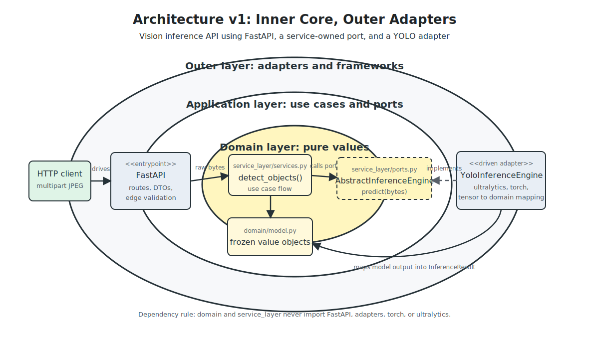
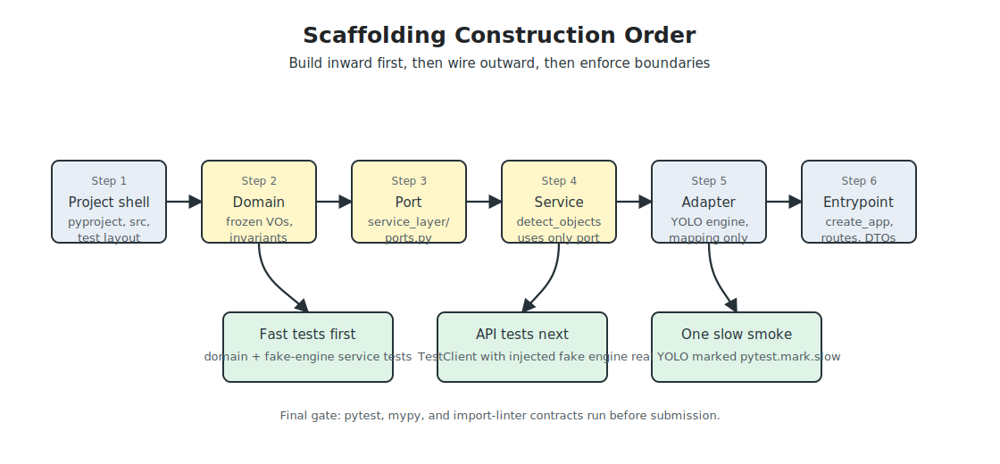

# Architecture v1 - Scaffolding Blueprint

> **Status:** implementation blueprint.
> **Scope:** how I would scaffold the assignment from `README.md` into a clean Python Ports and Adapters / Onion Architecture service.
> **Key correction from review:** the inference port lives in the application core, not in the concrete YOLO adapter module.

This version is written as the construction plan I would follow before creating the first production module. It keeps the dependency rule visible, defines the file boundaries, and makes the test seam explicit enough that route tests do not need to load the real YOLO model.

## 1. Architecture Shape



The service has one use case: accept a JPEG, run inference through an abstract engine, and return structured detection metadata. The HTTP framework and the ML
runtime are both outside the core.

| Layer | Package | Owns | Must not import |
| --- | --- | --- | --- |
| Domain | `inference.domain` | frozen value objects and domain invariants | `fastapi`, `pydantic`, `torch`, `ultralytics`, adapters |
| Service layer | `inference.service_layer` | use-case orchestration and ports | FastAPI, YOLO, `torch`, `ultralytics`, concrete adapters |
| Adapters | `inference.adapters` | concrete driven adapters, especially YOLO | entrypoints |
| Entrypoints | `inference.entrypoints` | FastAPI app, routes, DTOs, HTTP errors | no special restriction; this is the composition edge |

The important dependency direction is:

```text
entrypoints -> service_layer -> domain
adapters    -> service_layer.ports + domain
```

The inverse must never happen. In particular, the service layer imports `AbstractInferenceEngine` from `service_layer/ports.py`, not from `adapters/inference.py`.

## 2. Target Scaffold

```text
.
|-- pyproject.toml
|-- Makefile
|-- README.md
|-- .gitignore
|-- .importlinter
|-- models/
|   `-- .gitkeep
|-- docs/
|   |-- architecturev1.md
|   `-- diagrams/
|       |-- architecturev1-inner-outer.svg
|       `-- architecturev1-scaffold-sequence.svg
|-- src/
|   `-- inference/
|       |-- __init__.py
|       |-- bootstrap.py
|       |-- config.py
|       |-- domain/
|       |   |-- __init__.py
|       |   |-- exceptions.py
|       |   `-- model.py
|       |-- service_layer/
|       |   |-- __init__.py
|       |   |-- ports.py
|       |   `-- services.py
|       |-- adapters/
|       |   |-- __init__.py
|       |   `-- inference.py
|       `-- entrypoints/
|           |-- __init__.py
|           |-- app.py
|           |-- routes.py
|           `-- schemas.py
`-- tests/
    |-- conftest.py
    |-- assets/
    |   `-- sample.jpg
    |-- unit/
    |   |-- test_domain.py
    |   `-- test_services.py
    |-- integration/
    |   `-- test_api_fake_engine.py
    `-- e2e/
        `-- test_api_real_yolo.py
```

## 3. Construction Order



1. Create the project shell: `pyproject.toml`, `src/` layout, `pytest`, `mypy`, `import-linter`, and a `Makefile`.
2. Add the domain value objects first. These are pure Python and should pass tests without installing FastAPI or Ultralytics.
3. Add `service_layer/ports.py` with `AbstractInferenceEngine`.
4. Add `service_layer/services.py` with `detect_objects(image_bytes, engine)`.
5. Add a fake engine in tests and prove the service layer can run without YOLO.
6. Add the YOLO adapter under `adapters/inference.py`.
7. Add the FastAPI entrypoint with an app factory that can accept a fake engine.
8. Add a fake-engine API integration test.
9. Add one marked slow smoke test that uses the real YOLO engine and sample JPEG.
10. Lock the boundaries with `import-linter`, `mypy`, and `pytest`.

This order prevents the infrastructure from shaping the core. The adapter comes after the port, and the HTTP layer comes after the use case is already testable.

## 4. Domain Model

`domain/model.py` should contain only immutable dataclasses and stdlib imports:

```python
@dataclass(frozen=True)
class BoundingBox:
    x1: float
    y1: float
    x2: float
    y2: float

@dataclass(frozen=True)
class DetectionLabel:
    class_id: int
    name: str

@dataclass(frozen=True)
class Detection:
    box: BoundingBox
    label: DetectionLabel
    confidence: float

@dataclass(frozen=True)
class InferenceResult:
    image_width: int
    image_height: int
    model_name: str
    inference_ms: float
    detections: tuple[Detection, ...]
```

Domain exceptions should be limited to domain invariants:

- `DomainError`
- `InvalidBoundingBox`
- `InvalidConfidence`
- `InvalidImageDimensions`

I would not put `InvalidImageError` or `InferenceError` in the domain. A corrupt JPEG and a failed model call are boundary/runtime failures, so they belong near the port or adapter.

## 5. Port and Service Layer

`service_layer/ports.py` owns the abstract boundary:

```python
from abc import ABC, abstractmethod


class AbstractInferenceEngine(ABC):
    @abstractmethod
    def predict(self, image_bytes: bytes) -> InferenceResult:
        ...
```

The same module can define application/runtime exceptions that are part of the port contract:

```python
class InferenceEngineError(Exception):
    pass

class InvalidImageInputError(InferenceEngineError):
    pass

class InferenceRuntimeError(InferenceEngineError):
    pass
```

`service_layer/services.py` stays intentionally small:

```python
def detect_objects(
    image_bytes: bytes,
    engine: AbstractInferenceEngine,
) -> InferenceResult:
    if not image_bytes:
        raise InvalidImageInputError("image payload is empty")
    return engine.predict(image_bytes)
```

The service layer does flow control and depends on the port. It does not decode images, touch tensors, know HTTP status codes, or import `YoloInferenceEngine`.

## 6. YOLO Adapter

`adapters/inference.py` implements the port:

```python
class YoloInferenceEngine:
    def __init__(self, model_path: Path, model_name: str, confidence_threshold: float):
        self.model = YOLO(str(model_path))
        self.model_name = model_name
        self.confidence_threshold = confidence_threshold

    def predict(self, image_bytes: bytes) -> InferenceResult:
        ...
```

This is the only production module allowed to import `ultralytics`, `torch`, or image decoding libraries such as Pillow/OpenCV. It accepts bytes, runs the model, filters confidence if configured, and maps raw model output into domain value objects. Raw tensors never leave this adapter.

## 7. Entrypoint and App Factory

The FastAPI app should be built through a factory:

```python
def create_app(engine: AbstractInferenceEngine | None = None) -> FastAPI:
    @asynccontextmanager
    async def lifespan(app: FastAPI):
        app.state.engine = engine or bootstrap.build_engine()
        yield

    app = FastAPI(title="Vision Inference API", lifespan=lifespan)
    include_routes(app)
    register_exception_handlers(app)
    return app
```

The production command imports `app = create_app()` and gets the real engine.
Tests can use `create_app(engine=FakeInferenceEngine())`, so `TestClient` startup does not load YOLO unless the test explicitly asks for it.
`bootstrap.py` is the composition root and is the only core-adjacent module that binds `AbstractInferenceEngine` to `YoloInferenceEngine`.

`entrypoints/routes.py` should handle edge validation only:

- `multipart/form-data` with an uploaded file field.
- `Content-Type: image/jpeg`.
- non-empty bytes.
- configured max upload size.
- JPEG magic bytes: `FF D8 FF`.

Then it passes raw bytes and the injected engine to the service layer.

## 8. API Contract

The response contract should be explicit before implementation.

Success response:

```json
{
  "model": "yolov8n",
  "image": {
    "width": 1280,
    "height": 720
  },
  "inference_ms": 24.7,
  "detections": [
    {
      "label": {
        "class_id": 0,
        "name": "person"
      },
      "confidence": 0.91,
      "box": {
        "x1": 112.4,
        "y1": 88.0,
        "x2": 340.8,
        "y2": 612.5
      }
    }
  ]
}
```

Error response:

```json
{
  "error": {
    "code": "unsupported_media_type",
    "message": "Only image/jpeg uploads are supported."
  }
}
```

HTTP mapping:

| Condition | Exception/source | Status |
| --- | --- | --- |
| wrong media type | edge validation | `415` |
| empty body | edge validation or `InvalidImageInputError` | `400` |
| payload too large | edge validation | `413` |
| corrupt/undecodable JPEG | `InvalidImageInputError` | `422` |
| model/runtime failure | `InferenceRuntimeError` | `503` |
| unexpected failure | fallback handler | `500` |

DTOs live in `entrypoints/schemas.py`. Domain dataclasses are not the published HTTP contract.

## 9. Testing Plan

The test pyramid should prove the dependency boundaries:

| Test type | Path | Engine | Purpose |
| --- | --- | --- | --- |
| Domain unit | `tests/unit/test_domain.py` | none | value object invariants |
| Service unit | `tests/unit/test_services.py` | fake | use case calls only the port |
| API integration | `tests/integration/test_api_fake_engine.py` | fake | full FastAPI request/response without YOLO startup |
| Real smoke | `tests/e2e/test_api_real_yolo.py` | real YOLO | one marked slow end-to-end check |

The real smoke test should use `@pytest.mark.slow` and be excluded from the default fast test command if local iteration speed matters.

Suggested commands:

```text
make test          # unit + fake-engine integration
make test-slow     # includes real YOLO smoke
make lint          # import-linter + mypy
```

## 10. Import Guardrails

The `.importlinter` contract should enforce the written architecture:

```ini
[importlinter]
root_package = inference

[importlinter:contract:layers]
name = Onion layers
type = layers
layers =
    inference.entrypoints
    inference.adapters
    inference.service_layer
    inference.domain

[importlinter:contract:core-does-not-import-adapters]
name = Core does not import adapters
type = forbidden
source_modules =
    inference.domain
    inference.service_layer
forbidden_modules =
    inference.adapters

[importlinter:contract:core-is-framework-free]
name = Core is framework and ML free
type = forbidden
source_modules =
    inference.domain
    inference.service_layer
forbidden_modules =
    fastapi
    pydantic
    torch
    ultralytics

[importlinter:contract:adapters-do-not-import-entrypoints]
name = Adapters do not import entrypoints
type = forbidden
source_modules =
    inference.adapters
forbidden_modules =
    inference.entrypoints
```

These contracts address the main review concern: the service layer cannot import from the YOLO adapter, and the adapter layer cannot reach up into HTTP code.

## 11. AI Orchestration Strategy

I would use AI in narrow, layer-scoped prompts:

- First prompt: generate only domain dataclasses and tests, with no third-party
  imports allowed.
- Second prompt: generate `AbstractInferenceEngine` and service tests with a fake
  engine.
- Third prompt: generate the YOLO adapter that implements the already-written port.
- Fourth prompt: generate FastAPI routes and DTOs using `create_app(engine=None)`.
- Final prompt: inspect imports against the `.importlinter` contract and fix any
  boundary violations.

The human guardrail is that generated code must pass `pytest`, `mypy`, and `lint-imports` before it is considered acceptable. If AI suggests importing YOLO
inside routes or placing the ABC in `adapters/inference.py`, that is rejected because it breaks the dependency rule and makes fake-engine API tests impossible.

## 12. Submission Readiness Checklist

- README includes the same directory tree and clear install/test/run commands.
- `models/yolov8n.pt` is either downloaded by documented command or auto-fetched by Ultralytics on first run; weights are not committed.
- Default tests are fast and deterministic.
- Slow YOLO smoke test is clearly marked.
- API examples in README match `entrypoints/schemas.py`.
- Architecture docs explain the AI orchestration and guardrails required by the
  assignment.
