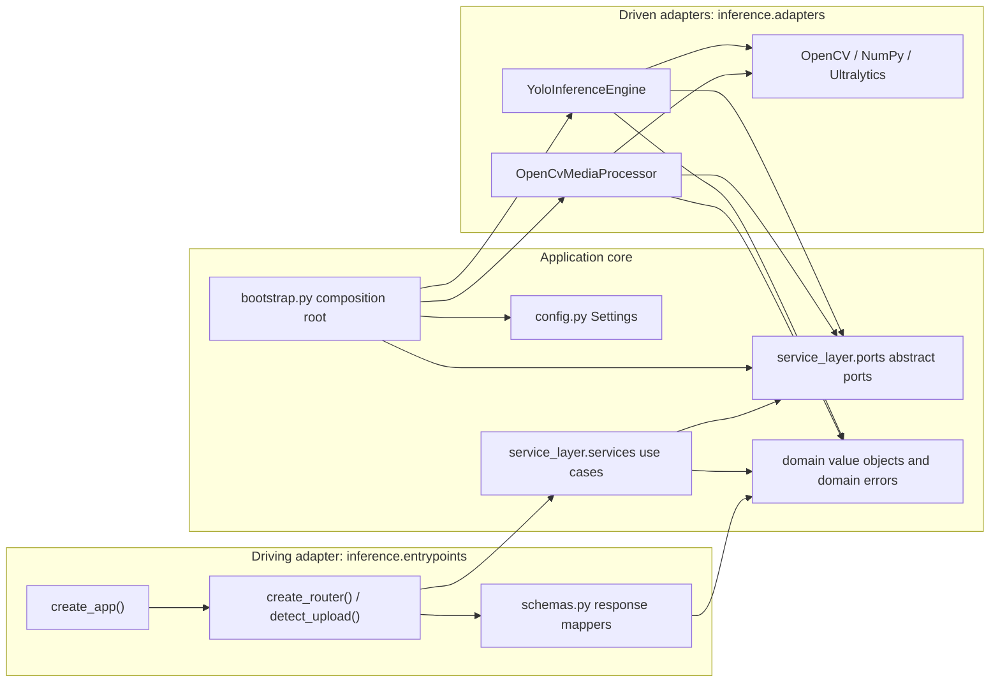
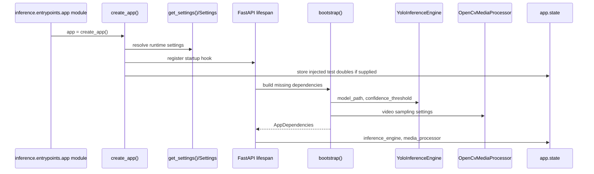
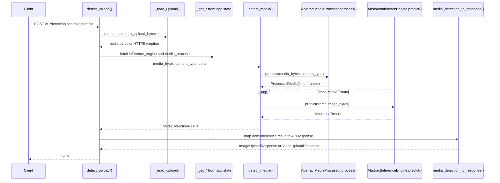
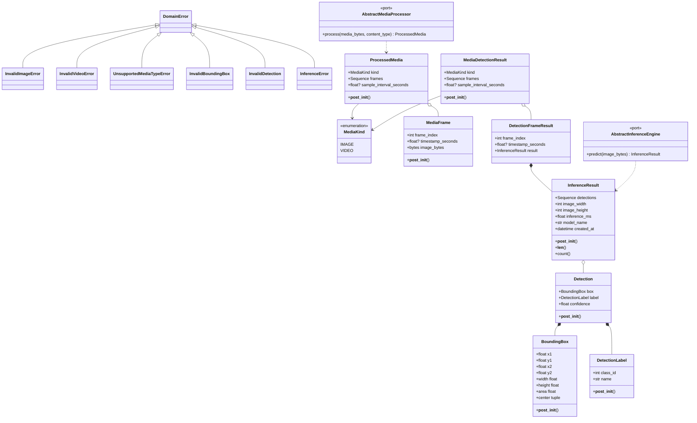
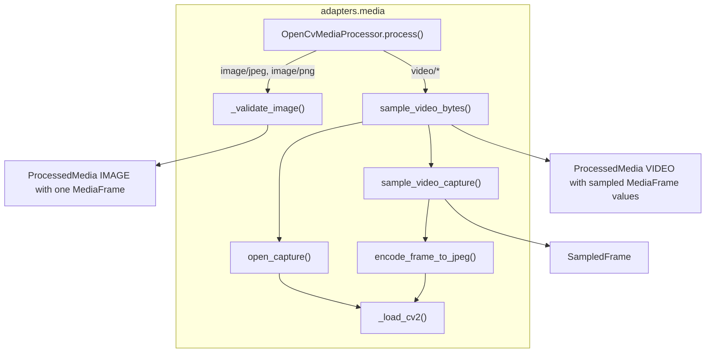
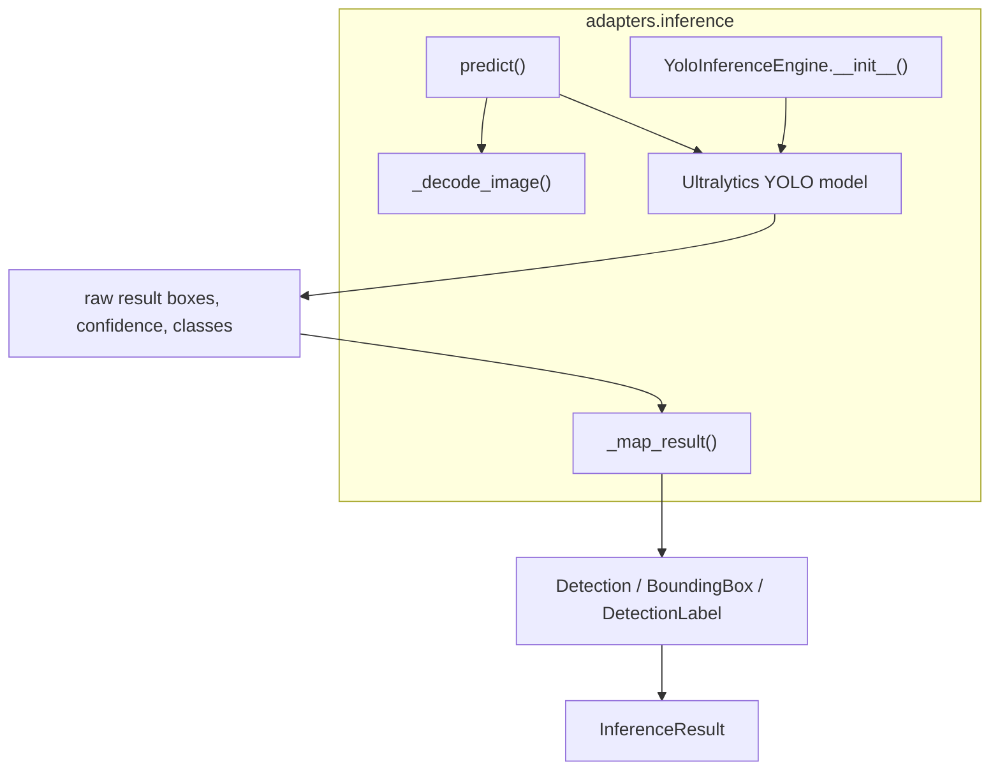
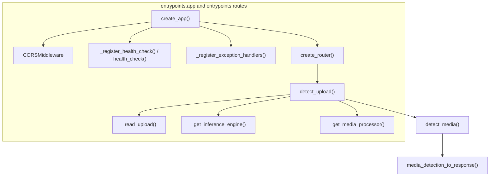
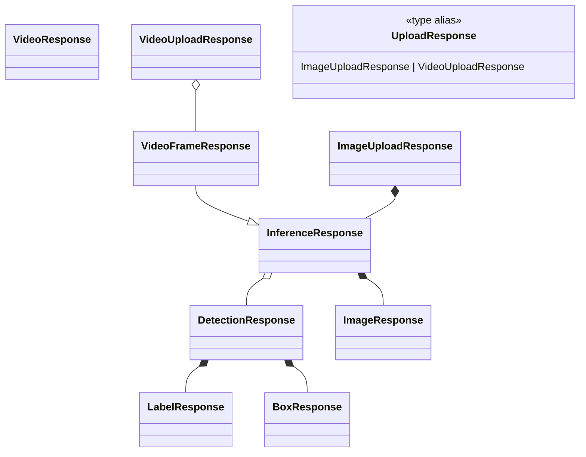
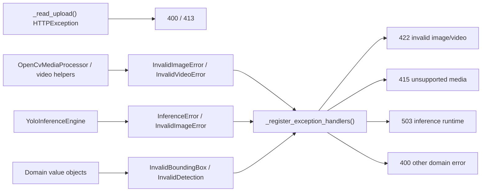
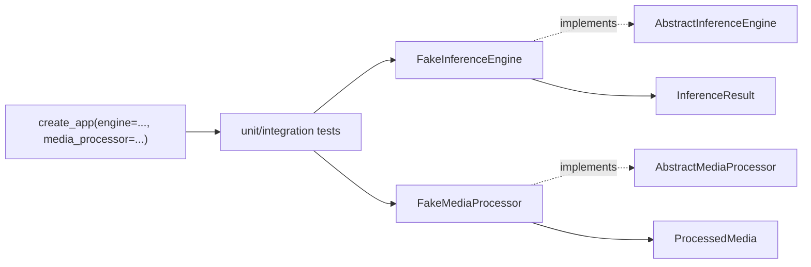

# Ports And Adapters Trace

> Status: implementation trace.
> Scope: production Python package under `backend/src/inference/`.

This document traces the current code as a Ports and Adapters backend. It is intentionally closer to the code than `architecture.md`: every production class and function is listed, with the diagrams showing where calls cross the application boundary.

## Layer Map

Dependency direction is the important rule: entrypoints and concrete adapters point inward to `service_layer` and `domain`; the service layer depends on the abstract ports, not on YOLO, OpenCV, or FastAPI.

## Startup And Composition

| Symbol | Role | Collaborators |
| --- | --- | --- |
| `Settings` | Immutable runtime configuration read from environment-backed defaults. | Used by `create_app()`, `bootstrap()`, and routes. |
| `_float_from_env()` | Converts optional env vars into floats. | Used by `Settings` defaults. |
| `_int_from_env()` | Converts optional env vars into ints. | Used by `Settings` defaults. |
| `get_settings()` | Creates a `Settings` instance. | Called by `create_app()` and `bootstrap()`. |
| `AppDependencies` | Container for concrete objects exposed through port types. | Returned by `bootstrap()`. |
| `bootstrap()` | Composition root binding ports to concrete adapters. | Creates `YoloInferenceEngine` and `OpenCvMediaProcessor`. |

## Request Flow

## Core Model And Ports

| Symbol | Interaction |
| --- | --- |
| `DomainError` | Base class caught by FastAPI exception handlers as a fallback domain/application failure. |
| `InvalidImageError` | Raised by edge/service/adapter code when an image payload is empty or undecodable; mapped to HTTP 422 except route-level empty upload, which is HTTP 400. |
| `InvalidVideoError` | Raised by media sampling/encoding failures; mapped to HTTP 422. |
| `UnsupportedMediaTypeError` | Raised by `OpenCvMediaProcessor` for unsupported content types; mapped to HTTP 415. |
| `InvalidBoundingBox` | Raised by `BoundingBox.__post_init__()` for invalid coordinates. |
| `InvalidDetection` | Raised by value objects and service result objects for invariant violations. |
| `InferenceError` | Raised by `YoloInferenceEngine` or media import code for runtime dependency/model failures; mapped to HTTP 503. |
| `BoundingBox` | Domain geometry object built by `YoloInferenceEngine._map_result()` and serialized by `detection_to_response()`. |
| `BoundingBox.__post_init__()` | Enforces non-negative `xyxy` coordinates and ordered corners. |
| `BoundingBox.width`, `height`, `area`, `center` | Derived geometry used only at serialization time. |
| `DetectionLabel` | Domain label object built from YOLO class IDs and names. |
| `DetectionLabel.__post_init__()` | Enforces non-negative IDs and non-blank names. |
| `Detection` | Domain object connecting a `BoundingBox`, `DetectionLabel`, and confidence score. |
| `Detection.__post_init__()` | Enforces confidence in `[0.0, 1.0]`. |
| `InferenceResult` | Aggregate returned by `AbstractInferenceEngine.predict()` and nested in service/API results. |
| `InferenceResult.__post_init__()` | Enforces image metadata, model name, non-negative timing, and normalizes detections to a tuple. |
| `InferenceResult.__len__()` / `count()` | Convenience detection-count APIs. |
| `MediaKind` | Domain enum separating image and video flows after media processing. |
| `MediaFrame` | Domain frame object produced by the media adapter and consumed by `detect_media()`. |
| `MediaFrame.__post_init__()` | Enforces valid frame index, timestamp, and non-empty image bytes. |
| `ProcessedMedia` | Domain aggregate returned by `AbstractMediaProcessor.process()`. |
| `ProcessedMedia.__post_init__()` | Enforces image/video frame-count and sample-interval rules. |
| `AbstractInferenceEngine.predict()` | Driven port for one-frame inference. Implemented by `YoloInferenceEngine`, faked by tests. |
| `AbstractMediaProcessor.process()` | Driven port for converting an upload into inference-ready frames. Implemented by `OpenCvMediaProcessor`, faked by tests. |
| `DetectionFrameResult` | Service-layer wrapper preserving frame metadata beside an `InferenceResult`. |
| `MediaDetectionResult` | Service-layer result returned to the HTTP adapter after all frames have been inferred. |
| `MediaDetectionResult.__post_init__()` | Enforces result-frame and video sample-interval rules. |
| `detect_objects()` | Validates non-empty one-frame bytes, then delegates directly to `AbstractInferenceEngine.predict()`. |
| `detect_media()` | Validates non-empty upload bytes, calls `AbstractMediaProcessor.process()`, then runs `detect_objects()` once per `MediaFrame`. |

## Driven Adapter Details

| `adapters.media` symbol | Interaction |
| --- | --- |
| `IMAGE_CONTENT_TYPES` | Content-type set used by `OpenCvMediaProcessor.process()` for image dispatch. |
| `VIDEO_CONTENT_TYPES` | Content-type-to-temp-file-suffix map used by `OpenCvMediaProcessor.process()` for video dispatch. |
| `CaptureLike` | Protocol describing the subset of `cv2.VideoCapture` needed by `sample_video_capture()` and tests. |
| `EncodedImageLike` | Protocol for OpenCV encoded image buffers returned by `cv2.imencode()`. |
| `Cv2Like` | Protocol for the small OpenCV surface used by this adapter. |
| `SampledFrame` | Adapter-local frame DTO yielded before conversion into domain `MediaFrame`. |
| `_load_cv2()` | Lazily imports OpenCV and converts missing optional dependencies into `InferenceError`. |
| `OpenCvMediaProcessor` | Concrete implementation of `AbstractMediaProcessor`. |
| `OpenCvMediaProcessor.__init__()` | Stores video sampling interval and max-frame cap from `Settings`. |
| `OpenCvMediaProcessor.process()` | Dispatches by content type; returns image `ProcessedMedia`, video `ProcessedMedia`, or raises `UnsupportedMediaTypeError`. |
| `OpenCvMediaProcessor._validate_image()` | Checks JPEG/PNG magic bytes before image bytes reach inference. |
| `open_capture()` | Opens a video source through OpenCV. |
| `encode_frame_to_jpeg()` | Converts sampled raw frames to JPEG bytes for the inference port. |
| `sample_video_capture()` | Reads frames from `CaptureLike`, samples by FPS and interval, yields `SampledFrame` values, and stops at `max_frames`. |
| `sample_video_bytes()` | Writes upload bytes to a temporary file, samples frames through `sample_video_capture()`, releases capture, removes the temp file, and rejects videos with no frames. |

| `adapters.inference` symbol | Interaction |
| --- | --- |
| `YoloInferenceEngine` | Concrete implementation of `AbstractInferenceEngine`. It is the only production class that owns the YOLO model. |
| `YoloInferenceEngine.__init__()` | Lazily imports `ultralytics.YOLO`, loads model weights, stores confidence threshold, and derives `model_name` from the model path. |
| `YoloInferenceEngine.predict()` | Decodes image bytes, runs YOLO, measures elapsed milliseconds, maps the first result into domain detections, and returns `InferenceResult`. |
| `YoloInferenceEngine._decode_image()` | Lazily imports OpenCV/NumPy, decodes bytes into an image array, and raises `InvalidImageError` if decoding fails. |
| `YoloInferenceEngine._map_result()` | Converts YOLO boxes/classes/confidences into immutable `Detection` objects; raw tensors stay inside the adapter. |

## Entrypoint And DTO Details

| Entrypoint symbol | Interaction |
| --- | --- |
| `create_app()` | Builds the FastAPI app, resolves settings, wires lifespan startup, optionally installs test doubles, includes routes, CORS, health check, and exception handlers. |
| `lifespan()` | Inner async context manager in `create_app()` that calls `bootstrap()` when real dependencies are needed. |
| `_register_health_check()` | Registers the backend health route used by Docker and local checks. |
| `health_check()` | Inner route function returning `{"status": "ok"}`. |
| `_register_exception_handlers()` | Registers domain/application exception mappings at the HTTP edge. |
| `invalid_image_handler()` | Inner handler mapping `InvalidImageError` to 422. |
| `invalid_video_handler()` | Inner handler mapping `InvalidVideoError` to 422. |
| `unsupported_media_type_handler()` | Inner handler mapping `UnsupportedMediaTypeError` to 415. |
| `inference_error_handler()` | Inner handler mapping `InferenceError` to 503. |
| `domain_error_handler()` | Inner fallback handler mapping other `DomainError` values to 400. |
| `create_router()` | Creates the `/v1/detect` router and closes over `Settings`. |
| `detect_upload()` | Reads the uploaded file, resolves both ports from app state, calls `detect_media()`, and maps the result to the API DTO. |
| `_read_upload()` | Enforces non-empty uploads and `MAX_UPLOAD_BYTES`, raising `HTTPException` for edge-only validation failures. |
| `_get_inference_engine()` | Casts `request.app.state.inference_engine` back to the inference port type. |
| `_get_media_processor()` | Casts `request.app.state.media_processor` back to the media port type. |

| `entrypoints.schemas` symbol | Interaction |
| --- | --- |
| `BoxResponse` | API DTO for raw and derived bounding-box geometry. |
| `LabelResponse` | API DTO for class ID and label name. |
| `DetectionResponse` | API DTO combining label, confidence, and box. |
| `ImageResponse` | API DTO for image dimensions. |
| `InferenceResponse` | API DTO for one image/frame inference result; serializes `model_name` as `model`. |
| `VideoFrameResponse` | Extends `InferenceResponse` with `frame_index` and `timestamp_seconds`. |
| `VideoResponse` | Currently unused DTO shape for a video response body; `VideoUploadResponse` is the active route response. |
| `ImageUploadResponse` | Top-level response for image uploads. |
| `VideoUploadResponse` | Top-level response for video uploads. |
| `UploadResponse` | Union response model accepted by FastAPI for `/v1/detect/upload`. |
| `detection_to_response()` | Maps domain `Detection` into Pydantic DTOs and includes derived `BoundingBox` properties. |
| `inference_to_response()` | Maps `InferenceResult` into an `InferenceResponse`. |
| `media_detection_to_response()` | Branches on `MediaKind`; returns image or video top-level upload DTOs. |

## Exception Boundary

The domain exceptions are framework-free. HTTP status codes are assigned only in `entrypoints.app`, while route-only upload size and empty-body validation uses FastAPI's `HTTPException` directly because those failures are request-envelope concerns.

## Test Doubles As Architecture Proof

The tests mirror the ports:

The fakes prove that `detect_media()` and the FastAPI route can run without loading YOLO or OpenCV. That is the current codebase's most concrete enforcement of the Ports and Adapters boundary, alongside the import-linter rules described in `architecture.md`.
